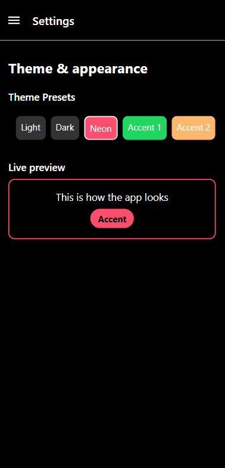

# IT5103N Group 2 - Activity Documentation

## Week 1

Progress:
   - made a mood journal app
   - experimented with pictures/gif

## Week 2

Progress:
   - changed the theme to dark
   - login page
   - added drawer
   - made profile page with logout button
     

  
  
  
  

## Week 3 - Activity (Advanced Navigation)

I implemented natural gestures — the drawer opens with a swipe, touchables/pressables use hitSlop (and Android ripple) for comfortable tapping, and icons/buttons open modals or navigate between screens. For transitions I used react-native-reanimated: FadeIn/FadeOut for error messages and the preview, layout spring animations for list changes, and a small shake effect to highlight invalid inputs. For persistence I used AsyncStorage with a hydration guard so data loads before any saves, debounced writes to avoid race conditions, and explicit cache clears on actions like form submit or removals.

Progress:
   - implemented gestures and navigation persistence
   - added transitions

## Week 4 - Activity 1 (State Management)

I use useReducer for playlist/song state (so actions and undo/redo stay explicit) and useState for small UI bits like modal inputs; reducers are kept pure and immutable. Persistence is handled with AsyncStorage plus a hydration guard so the app loads data first and only writes after initial load to avoid clobbering. For testing I write unit tests for reducers with Jest to confirm each action yields the right state, then use React Native Testing Library for integration tests that exercise UI flows and AsyncStorage behavior. Finally I do quick manual smoke/E2E checks (add/edit/remove items, restart app, test back navigation) to catch real-world edge cases.

Progress:
   - updated playlist page (can add, remove, and edit playlist)
   - added playlist detail (can add and remove songs)
   - added transitions and animations
   - implemented undo/redo

  
  

Progress:
   - updated the adding and editing of playlist
   - updated the adding of songs inside a playlist

  
  
  
  
  

## Week 4 - Activity 2 (Spotify Profile Creation Form)

I validate inputs live as the user types: usernames must be 3–20 characters and can include letters, numbers, and underscores; emails must match a standard email format; and a genre must be selected from the list. For animations I used react-native-reanimated — invalid inputs get a quick shake to draw attention and error messages/preview fade in smoothly. The preview updates instantly as I type and uses a genre-based placeholder image; cached form data is saved to AsyncStorage and cleared on successful submit so the form auto-fills after reload but resets when submission succeeds.

Progress:
   - updated profile page
   - added profile preview

  
  

## Week 5 - Activity 1 (Theme Switcher)

I implemented a centralized theme using Redux as the single source of truth so changes propagate consistently across all screens. I added smooth color and fade transitions with react-native-reanimated to make theme switching feel polished and responsive. Theme mode and accent colors are persisted to AsyncStorage so the app reliably restores the user’s preferences after a restart. The Settings screen provides preset themes and quick accent selections for straightforward customization.

Progress:
   - added themes to pick (light, dark, custom)

-- LIGHT --

  
  
  
  

-- DARK --

  
  
  
  

-- CUSTOM ACCENTS (Can be LIGHT or DARK) --

  
  

